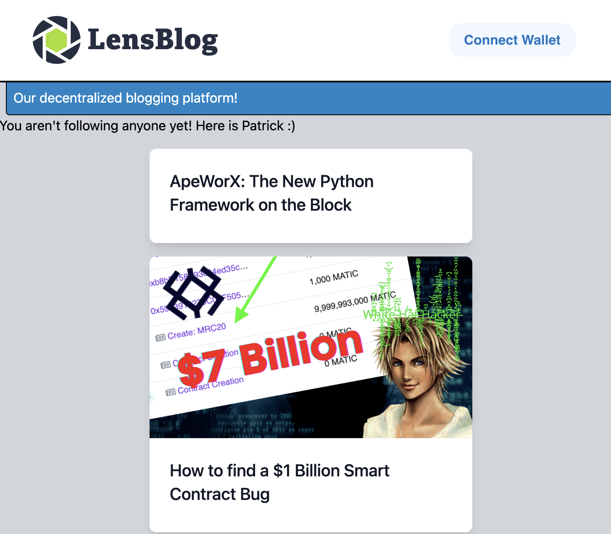

<br/>
<p align="center">
<a href="https://www.lens.xyz/" target="_blank">

</a>
</p>
<br/>

# LensBlog

## About

A demo decentralized blogging platform built off [LensProtocol](https://www.lens.xyz/). It's feature limited, but it can:

- View Articles of people you follow
- Post Articles

_Posting via base64 encoded contentURIs currently isn't indexed by the lens API. You can still do it since the data will be on chain, but for the lens API to index, we need to upload our data to something like IPFS first, which is why we have optional [Pinata](https://app.pinata.cloud/) support._

# Getting Started 

## Requirements

- [git](https://git-scm.com/book/en/v2/Getting-Started-Installing-Git)
  - You'll know you did it right if you can run `git --version` and you see a response like `git version x.x.x`
- [Nodejs](https://nodejs.org/en/)
  - You'll know you've installed nodejs right if you can run:
    - `node --version`and get an output like: `vx.x.x`
    - You'll also need `npm`

## Quickstart

1. Clone and install dependencies
   
```bash
git clone https://github.com/PatrickAlphaC/lens-blog/
cd lens-blog
npm i
```

2. Start the dev server

```
npm run dev
```

If you go to `localhost:3000` you'll see something that looks like:

.

If you connect your wallet, and sign into Lens, it'll populate with Articles from those you follow. Then, you can go and write an article. 

# Writing Queries

Lens Protocol is a decentralized smart contract, however, reading from smart contracts can sometimes be hard. So the lens team currently has a centralized API you can query to build apps easier. The easiest way I've found to write queries is to take the `api.lens.dev` URL, and stick it into:

https://studio.apollographql.com/sandbox/explorer

It will auto populate with the schema and write your `gql` queries as you pick the parameters you want. 

You can also try queries here: https://api.lens.dev/

# Contributing

Contributions are always welcome! Open a PR or an issue!

# Thank You!
